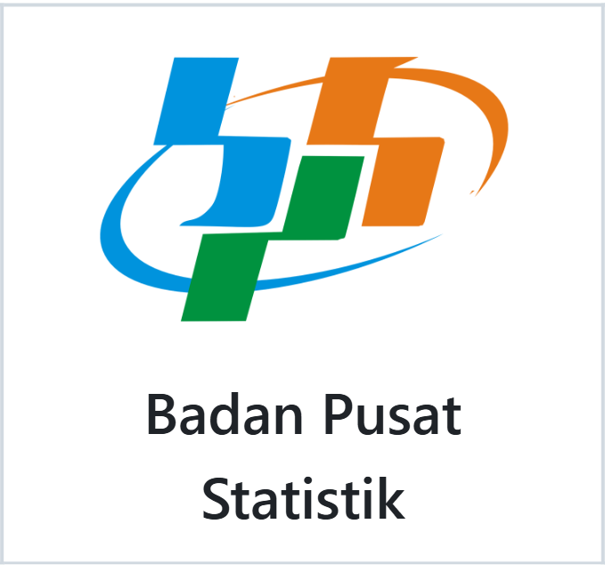
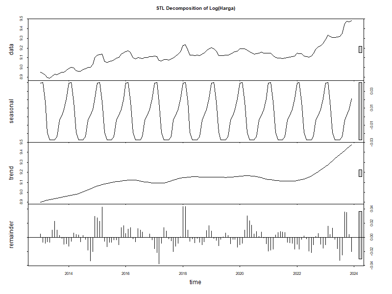
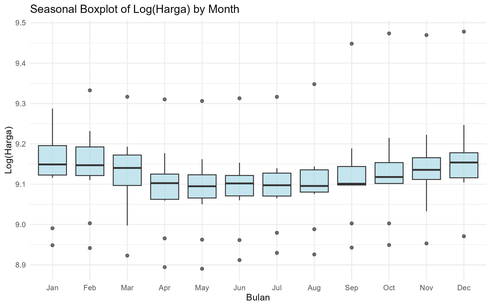
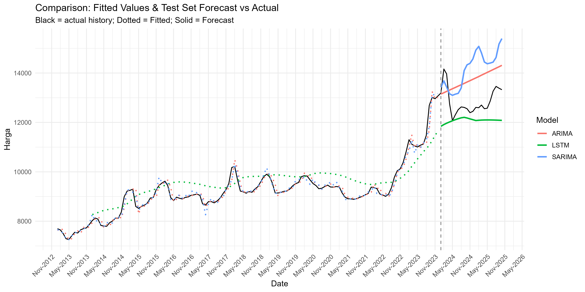
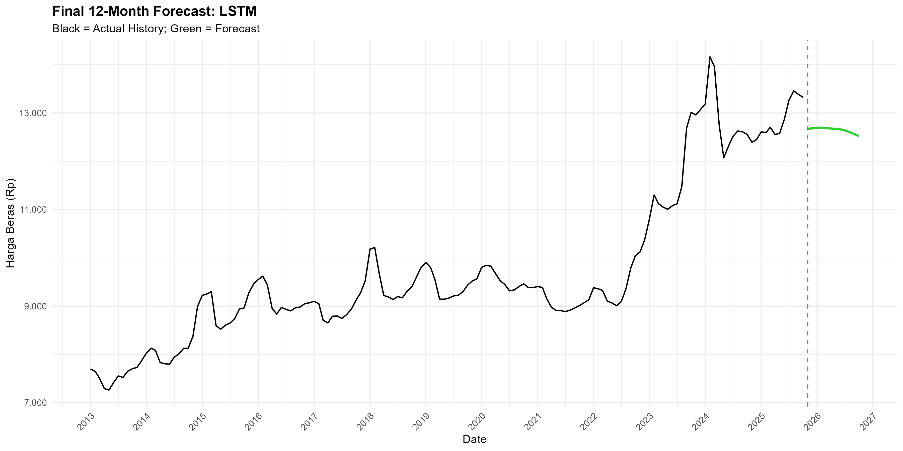

# 🍚 Model Prediktif Harga Beras: Komparasi ARIMA, SARIMA, & LSTM

<p align="center">
  
</p>

## 📖 Deskripsi Proyek  
Proyek ini menganalisis dan membandingkan akurasi tiga metode peramalan deret waktu—**ARIMA, SARIMA, dan LSTM**—dalam memprediksi **harga beras medium di Indonesia** menggunakan data bulanan Januari 2013–Oktober 2025 dari BPS. Tujuan utamanya adalah mengidentifikasi model yang paling efektif dalam menangkap tren jangka panjang, pola musiman, dan dinamika non-linear pada harga beras.
Hasil analisis diharapkan dapat memberikan dasar yang lebih kuat bagi perumusan kebijakan stabilisasi harga pangan berbasis data.

_“Prediksi yang akurat hari ini untuk ketahanan pangan esok hari.”_

---

## 🇮🇩 Latar Belakang   
Beras merupakan komoditas pangan strategis di Indonesia karena perannya yang langsung memengaruhi daya beli masyarakat, inflasi, dan stabilitas kebijakan pangan nasional. Pergerakan harga beras dalam satu dekade terakhir menunjukkan adanya tren kenaikan yang dibarengi pola musiman serta volatilitas yang cukup tinggi, sehingga menuntut metode peramalan yang lebih adaptif terhadap dinamika tersebut.

Model ARIMA telah menjadi pendekatan klasik yang efektif dalam menangkap autokorelasi dan tren jangka pendek pada deret waktu (Box et al., 2015). Ketika struktur musiman terdeteksi, model SARIMA menjadi perluasan yang relevan untuk memodelkan pola berulang dalam data. Di sisi lain, model berbasis jaringan saraf seperti Long Short-Term Memory (LSTM) menawarkan kemampuan untuk mengenali hubungan non-linear dan ketergantungan jangka panjang yang sering tidak tertangkap oleh model statistik tradisional (Hochreiter & Schmidhuber, 1997; Greff et al., 2017).

Dengan membandingkan ketiga pendekatan tersebut, penelitian ini bertujuan mengidentifikasi metode prediksi harga beras yang paling akurat dan mampu menggambarkan dinamika kompleks pasar beras Indonesia.

---

## 🎯 Tujuan  
1. Menganalisis pola historis harga beras medium di Indonesia, meliputi tren jangka panjang, pola musiman, dan dinamika volatilitas
2. Membangun dan mengevaluasi model ARIMA, SARIMA, dan LSTM dalam memprediksi harga beras medium berdasarkan karakteristik deret waktunya
3. Menentukan model prediksi yang paling akurat dan paling representatif terhadap dinamika harga beras medium
4. Menghasilkan proyeksi harga beras medium untuk 12 bulan ke depan menggunakan model terbaik

---

## 📊 Data dan Variabel  
<p align="center">
  
</p>

<div align="center">
  <strong>Variabel:</strong> harga beras medium bulanan dari Januari 2013 s.d. Oktober 2025
</div>

---

## 💡 Metodologi
<p align="center">
  
<p align="center"><i>Gambar 1. Flowchart Metode Prediksi Harga Beras Medium di Indonesia</i></p>

---

## 📝 Prosedur Analisis
**1. Pengumpulan dan Persiapan Data**
- Mengumpulkan data harga beras medium bulanan periode Januari 2013–Oktober 2025
- Memastikan konsistensi format tanggal
- Menghapus inkonsistensi dan memastikan data siap dianalisis sebagai deret waktu
    
**2. Pembentukan Deret Waktu dan Pembagian Data**
- Mengonversi data menjadi objek deret waktu dengan frekuensi bulanan
- Membagi data menjadi:
  - **Training set:** Jan 2013 – Des 2023
  - **Test set:** Jan 2024 – Okt 2025
  
**3. Transformasi Data**
- Menerapkan transformasi logaritmik untuk menstabilkan varians dan mengurangi heteroskedastisitas
- Melakukan normalisasi min–maks khusus untuk model LSTM
  
**4. Eksplorasi Data**
- Menampilkan statistik deskriptif awal seperti nilai minimum, maksimum, rata-rata, dan tren umum harga
- Membuat visualisasi deret waktu untuk mengidentifikasi tren jangka panjang
- Memeriksa kestasioneran awal dengan membuat plot ACF dan PACF harga asli dan harga log
- Mengidentifikasi potensi outlier pada grafik deret waktu
  
**5. Pemodelan ARIMA**
- Mengestimasi model ARIMA menggunakan fungsi `auto.arima()` untuk pemilihan orde (p, d, q) secara otomatis berdasarkan AIC/AICc/BIC
- Melakukan diagnostik residual (ACF residual, uji Ljung–Box, uji normalitas)
  
**6. Pemodelan SARIMA**
- Mengestimasi `auto.arima(..., seasonal = TRUE)` untuk menangkap pola musiman. Pemilihan komponen musiman (P, D, Q, s) dilakukan secara otomatis berdasarkan AIC/AICc/BIC
- Melakukan diagnostik residual (ACF residual, uji Ljung–Box, uji normalitas)
  
**7. Pemodelan LSTM**
- Melakukan normalisasi min–maks pada data
- Menentukan batasan sliding window
- Melatih model LSTM
  
**8. Evaluasi Kinerja Model**
- Menghitung RMSE, MAE, dan MAPE pada test set
- Melakukan evaluasi visual antara nilai aktual dan prediksi
- Membandingkan performa model ARIMA, SARIMA, dan LSTM
  
**9. Peramalan Periode Mendatang**
- Memilih model dengan performa terbaik pada test set
- Melakukan peramalan ke depan (November 2025 - Oktober 2026) dengan menggunakan model terbaik
  
---

## 🧠 Teknologi dan Tools yang Digunakan  

| **Kategori**               | **Tools / Library** |
|---------------------------|----------------------|
| **Bahasa Pemrograman**    | R |
| **Pengolahan Data**       | `dplyr`, `tidyr`, `tibble`, `lubridate`, `zoo` |
| **Visualisasi Data**      | `ggplot2`, `acf`, `pacf`, `stl`, *base R plotting* |
| **Model Deret Waktu**     | `forecast` (ARIMA, SARIMA, `auto.arima`, `forecast`, `checkresiduals`), `tseries` (`adf.test`, `jarque.bera.test`), `stats` (fungsi dasar time series) |
| **Deep Learning**         | `keras`, `tensorflow` |

---

## 🗂️ Struktur Proyek  

```
forecast-harga-beras/
│
├── data/
│   ├── Data Raw/
│   │   └── Data Harga Beras 2013-2025.xlsx
│   └── Data Clean/
│       └── harga_beras_clean.xlsx             # hasil cleaning tanggal
│
├── R/
│   ├── 01_load_preprocess.R                   # load, transformasi log, ts(), window(), train/test
│   ├── 02_arima_log.R                         # ARIMA(log) + residual check + prediksi test set + simpan hasil
│   ├── 03_sarima_log.R                        # SARIMA(log) + residual check + prediksi test set + simpan hasil
│   ├── 04_lstm_log.R                          # LSTM (log + min-max) + prediksi test set + simpan hasil
│   ├── 05_compare_models.R                    # perbandingan model (metrics + visualisasi)
│   └── 06_run_all.R                           # gabungan syntax R yang dijalankan
│
├── models/
│   ├── arima_model_log.rds
│   ├── sarima_model_log.rds
│   └── lstm_model_log.h5
│
├── plots/
│   ├── eda/
│   │   ├── ts_plot_level.png
│   │   ├── ts_plot_log.png
│   │   ├── stl_decomposition_log.png
│   │   ├── seasonal_boxplot_log.png
│   │   ├── acf_pacf_level_log.png
│   │   ├── acf_pacf_diff1_log.png
│   │   └── acf_pacf_diff1_D1_log.png
│   ├── arima/
│   │   ├── arima_residual_check.png
│   │   ├── arima_acf_pacf_residual.png
│   │   └── arima_evaluation_plot.png
│   ├── sarima/
│   │   ├── sarima_residual_check.png
│   │   ├── sarima_acf_pacf_residual.png
│   │   └── sarima_evaluation_plot.png
│   ├── lstm/
│   │   ├── lstm_loss_curve.png
│   │   └── lstm_evaluation_plot.png
│   └── compare/
│       ├── compare_evaluation_forecast.png
│       └── final_forecast_lstm.png
│
└── results/
    ├── descriptive_stats_harga_asli.csv
    ├── outliers_identified_dates.csv
    ├── predictions_test_per_model_log.csv
    ├── metrics_test_log.csv
    └── final_forecast_model_terbaik.csv
```
---

## ⭐ Fitur Proyek
1. Identifikasi tren harga beras medium di Indonesia
2. Pembangunan model peramalan harga beras medium dengan ARIMA, SARIMA, dan LSTM
3. Evaluasi model dengan menggunakan metrik RMSE, MAE, dan MAPE
4. Visualisasi hasil peramalan harga beras bulan November 2025 s.d Oktober 2026 dengan model terbaik
     
---

## 📊 Cuplikan Visual
<p align="center">
  
</p>
<p align="center"><i>Gambar 2. Tren Harga Beras Medium di Indonesia</i></p>

<p align="center">
  
</p>
<p align="center"><i>Gambar 3. Seasonal Boxplot Harga Beras Medium di Indonesia</i></p>

<p align="center">
  
</p>
<p align="center"><i>Gambar 4. Pemodelan Harga Beras Medium dengan ARIMA, SARIMA, dan LSTM</i></p>

<p align="center">
  
</p>
<p align="center"><i>Gambar 5. Hasil Peramalan Harga Beras Medium Bulan November 2025-Oktober 2026 (Model Terbaik)</i></p>

| Tahun | 2025 | 2025 | 2026 | 2026 | 2026 | 2026 | 2026 | 2026 | 2026 | 2026 | 2026 | 2026 |
|:-----:|:----:|:----:|:----:|:----:|:----:|:----:|:----:|:----:|:----:|:----:|:----:|:----:|
| Bulan | Nov  | Des  | Jan  | Feb  | Mar  | Apr  | Mei  | Jun  | Jul  | Ags  | Sep  | Okt  |
| Forecast (Rp) | 12,669 | 12,681 | 12,694 | 12,693 | 12,689 | 12,678 | 12,671 | 12,661 | 12,640 | 12,605 | 12,563 | 12,525 |

---

## 🔬 Evaluasi Model Terbaik
```
  Model        RMSE   MAE   MAPE
  <chr>       <dbl> <dbl>  <dbl>
1 ARIMA(log)  1064. 1016. 0.0796
2 SARIMA(log) 1549. 1393. 0.1090 
3 LSTM(log)    968.  779. 0.0589
```
  
---

## 🚀 Manfaat Penelitian

Penelitian ini bermanfaat dalam menyediakan prediksi harga beras yang akurat sebagai dasar pengambilan keputusan, memperkaya literatur analisis time series pada komoditas pangan, serta mendukung penyusunan kebijakan stabilisasi harga oleh pemerintah.

---

## 📚 Referensi

1. Badan Pusat Statistik. (2025). _Rata-Rata Harga Beras Bulanan di Tingkat Penggilingan Menurut Kualitas_. Diakses pada 15 November 2025, dari https://www.bps.go.id/id/statistics-table/2/NTAwIzI=/rata-rata-harga-beras-bulanan-di-tingkat-penggilingan-menurut-kualitas.html.
2. Box, G. E. P., Jenkins, G. M., Reinsel, G. C., & Ljung, G. M. (2015). *Time Series Analysis: Forecasting and Control* (5th ed.). Wiley.  
3. Greff, K., Srivastava, R. K., Koutník, J., Steunebrink, B. R., & Schmidhuber, J. (2017). LSTM: A Search Space Odyssey. *IEEE Transactions on Neural Networks and Learning Systems*, 28(10), 2222-2232.  
4. Hochreiter, S., & Schmidhuber, J. (1997). Long Short-Term Memory. *Neural Computation*, 9(8), 1735-1780.  

---

## 👥 Anggota Kelompok  
- [Nur Aulia Maknunah](https://github.com/nurauliamaknunah) (M0501251009)
- [Inria Purwaningsih](https://github.com/inriap8) (M0501251025)
- [Markazul Adabiyah](https://github.com/markazuladabiyah) (M0501251035)
- [Viren Marcellya Clarenda Siboro](https://github.com/virenmarcellya12) (M0501251047)
- [Muhammad Hanif Nafiis](https://github.com/HanifNaf) (M0501251055)
